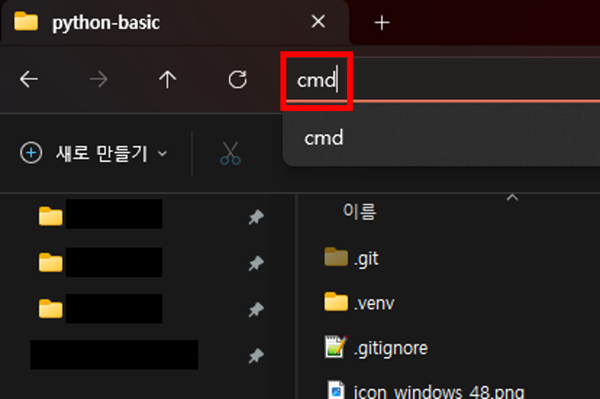
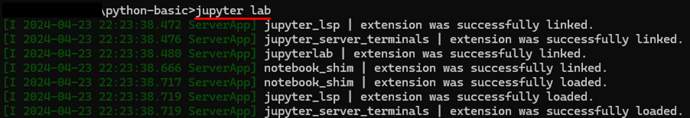

# Python 기본

Python3 기초 공부 모음집

## 환경설정
- Windows PC 사용
- [Python3](https://www.python.org/downloads/) 설치
- JupyterLab 설치
  - 시작(키) > 명령 프롬프트 > "jupyterlab" 설치
    ```bash
    $ pip install jupyterlab
    ```

## JupyterLab 실행
- Root 폴더에서 주소창 클릭 > 다 지우고 "cmd" 입력 후 엔터

- "jupyter lab" 실행


## 학습 방법
- 각 챕터별 "practice_X.ipynb" 노트북을 통해 학습
- 각 챕터별 "quiz_X.ipynb" 노트북을 통해 문제풀이 학습

## 목차
|No.|주제|업데이트|
|:-:|---|---|
|1|파이썬 소개|2024.4.24|
|2|자료형|2024.4.24|
|3|연산자|2024.4.24|
|4|숫자 자료형 관련 함수|2024.4.24|
|5|문자열 다루기||
|6|기본 자료구조||
|7|흐름 제어||
|8|함수||
|9|입력/출력||
|10|클래스||
|11|예외 처리||